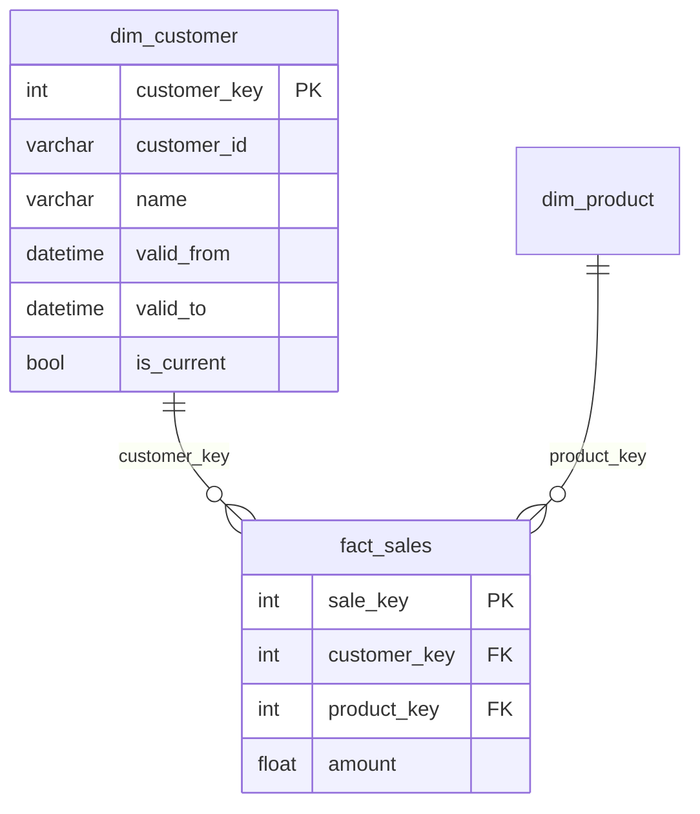

# SchemaGraph Reference

`SchemaGraph` introspects your model definitions to build a relational map of dimensions, facts, and bridges — used for documentation, validation, and diagram generation.

## SchemaGraph

```python
from sqldim.core.kimball import SchemaGraph

graph = SchemaGraph(models=[CustomerDim, ProductDim, SalesFact])
```

### Constructor

```python
class SchemaGraph:
    def __init__(self, models: List[Type[Any]]): ...
```

| Parameter | Type | Description |
|---|---|---|
| `models` | `List[Type[Any]]` | List of `DimensionModel`, `FactModel`, and `BridgeModel` classes to register |

### from_models()

Alternative constructor (class method).

```python
@classmethod
def from_models(cls, models: List[Type[Any]]) -> "SchemaGraph": ...
```

Equivalent to the constructor — use whichever you prefer.

### to_dict()

Serialise the graph to a dictionary.

```python
def to_dict(self) -> Dict[str, Any]: ...
```

Returns a nested dict containing:
- Model names, types (`dimension`, `fact`, `bridge`), and table names
- `__grain__` and `__fact_type__` for fact models
- `__natural_key__` and `__scd_type__` for dimension models
- Foreign-key relationships between models
- Field-level metadata (measure, additive, dimension references)

```python
import json

graph = SchemaGraph(models=[CustomerDim, SalesFact])
print(json.dumps(graph.to_dict(), indent=2))
```

### to_mermaid()

Generate a Mermaid ER diagram string.

```python
def to_mermaid(self) -> str: ...
```

Returns a `mermaid` code block that renders a star/snowflake schema diagram with FK relationships.

```python
graph = SchemaGraph(models=[CustomerDim, ProductDim, SalesFact])
print(graph.to_mermaid())
```

Output:



Embed in Markdown:

````markdown
```mermaid
{{ graph.to_mermaid() }}
```
````

### CLI Integration

The `sqldim schema graph` command prints guidance for using these methods. In practice, build the graph in a script:

```python
from sqldim.core.kimball import SchemaGraph
from my_project.models import CustomerDim, SalesFact

graph = SchemaGraph(models=[CustomerDim, SalesFact])

# Write Mermaid to file
with open("schema.mmd", "w") as f:
    f.write(graph.to_mermaid())

# Write JSON for tooling
import json
with open("schema.json", "w") as f:
    json.dump(graph.to_dict(), f, indent=2)
```

## Model Classification

`SchemaGraph` classifies models by their base class:

| Base Class | Classification | `__fact_type__` |
|---|---|---|
| `DimensionModel` | `dimension` | — |
| `FactModel` | `fact` | From `FactType` enum or `None` |
| `BridgeModel` | `bridge` | — |
| `VertexModel` | `vertex` | — |
| `EdgeModel` | `edge` | — |

Models with `VertexModel` or `EdgeModel` (from `sqldim.core.graph`) are also tracked for the graph projection layer.

## See Also

- [Dimensions Reference](dimensions.md) — `DimensionModel`, `BridgeModel` definitions
- [Fact Types Reference](fact_types.md) — `FactType` enum and `__fact_type__` values
- [CLI Reference](cli.md) — `sqldim schema graph` command
- [Dual-Paradigm Pattern](../patterns/dual_paradigm.md) — using SchemaGraph for graph projection
